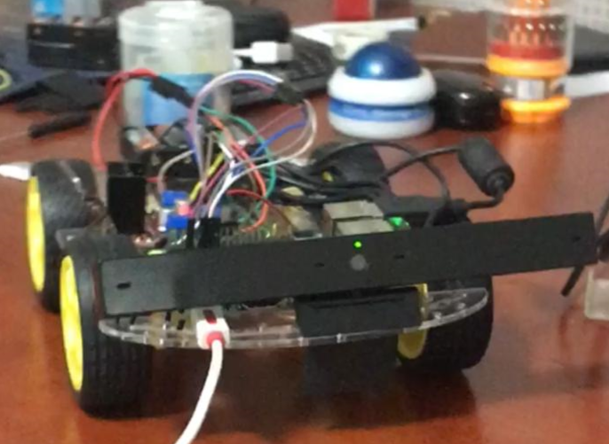

# Project Laura: 

In this project, the plan was to build a car that can somehow 
interact with a human being. It began with a Raspberry Pi, a fancy webcam from the late 2000s,
and some other tools that I was able to buy from the local store. 

### Version 1 of Laura

Tools used to build Laura: 

* Power bank
* Raspberry Pi model 3B+
* Male to Female, Male to Male, Female to Female wires
* Two 9 Volt batteries 
* Arduino sound amplifier 
* Generic cheap speaker
* Regular old wire spools
* Arduino motor control unit 
* 4 basic car motors
* Plastic car frame
* Plastic/rubber wheels 
* A random old webcam from the late 2000s 

To put this thing together, I followed a tutorial by Sentdex on youtube. You can find his channel here: https://www.youtube.com/user/sentdex , 
he has a lot of fun and easy to follow tutorials on various aspects of programming. I highly recommend a look at his channel.

After building Laura's body, she still needed a brain. The idea was to automate Laura and send her off looking for human faces to follow. 
An Open CV model, taken from Jabril's drone experimentation. He also has a load of programming stuff on his youtube channel. https://www.youtube.com/jabrils
Laura was then taught to follow human faces around using the GPIO library and the model. 

The speaker that was added to Laura was a small addition that allows for very minimal interaction. Laura will simply say
"Hello Human(s)" depending on how mnay faces she sees. 

Currently, the second version, which already has a built body, includes a modular NN that will memorize the faces, through training on each recognized human 
face and then categorize them. The model is still in development, but the first version (Laura.py) is fully operational. 

 